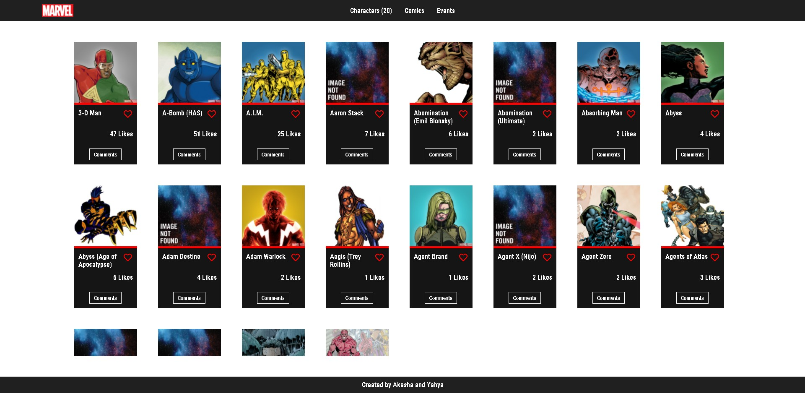
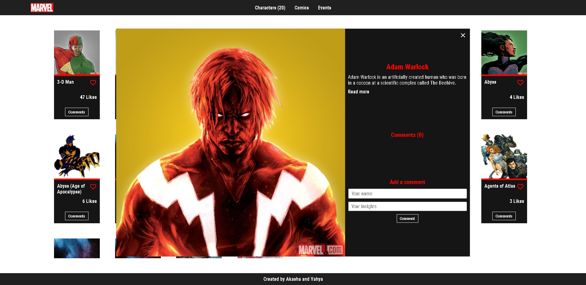

# Marvel Characters

**A Marvel superheroes website that displays Characters from the Marvel API**

## Screenshot

### Desktop screenshot



### Popup screenshot



## Built With

- Major languages: HTML, SCSS, JS
- Technologies used: Webpack

## Live Demo

- [View Demo](https://www.akasharojee.codes/marvel-api/)

## Getting Started

To get a local copy up and running, follow the steps below in your terminal.

### Prerequisites

- Node.js
- npm

_For more information, <a href="https://www.akasharojee.codes/2021/06/20/intro-to-nodejs-and-npm.html" target="_blank">view the section **Installation** in this guide about Node.js and npm</a>._

### Setup

Clone the project:

```
git clone https://github.com/AkashaRojee/marvel-api.git
```

### Install

There are currently no production dependencies.

Install the development dependencies:

```
npm install
```

### Usage

The assets are in the `src` directory.

The output is in the `docs` directory.

### Deployment

**Note**: The default output directory of Webpack (`dist`) has been renamed to `docs` to facilitate publishing from GitHub Pages.

To build the website:

```
npm run build
```

To serve the website directly:

```
npm run start
```

## Authors

**Akasha Rojee**

- GitHub: [@AkashaRojee](https://github.com/AkashaRojee)
- Twitter: [@AkashaRojee](https://twitter.com/AkashaRojee)
- LinkedIn: [AkashayahyaRojee](https://linkedin.com/in/AkashaRojee)

**Yahya EL Ganayni**

- GitHub: [@yahyaELganayni](https://github.com/yahyaelganyni1)
- Twitter: [@yahyaELganayni](https://twitter.com/@crazy20046)
- LinkedIn: [yahyaELganayni](https://www.linkedin.com/in/yahya-el-ganayni-a456115b/)

## 🤝 Contributing

Contributions, issues, and feature requests are welcome!

Feel free to check the [issues page](../../issues/).

## Show your support

Give a ⭐️ if you like this project!
